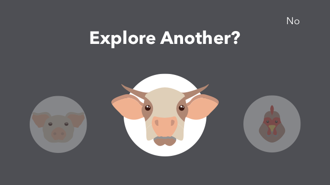
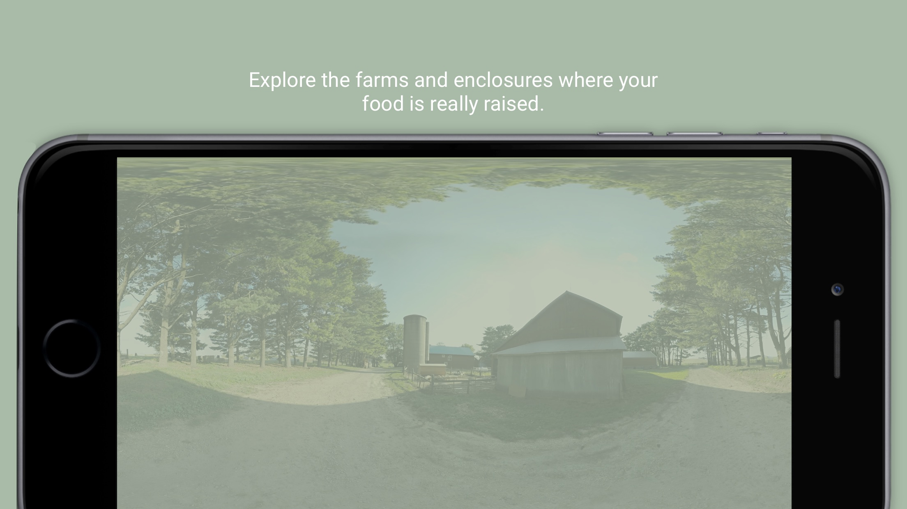

# at the fork virtual reality app
- user experience design
- visual design

# Brief
**Client:** Whole Foods Market & the Humane Society of the United States

**The Challenge:** Tell our customers a compelling story about the real experiences of farm animals, but don't freak them out.

# Background
In partnership with Whole Foods Market and the Humane Society of the United States, the [creative agency I work for](http://emergentorder.com) created a feature documentary that explores how farm animals are raised for our consumption; it’s an incredibly nuanced and gorgeous and sensitive film, and that’s what really sets it apart from its competition. It seeks to understand the conditions in which real animals live, *and* the economic pressure that American farmers face.

I worked on two deliverables for the distribution & marketing campaigns: **a website** for the film, and the interaction design for **a 3D virtual reality app** that explored the farms that the filmmakers visited.

# Challenges
With a tight timeline, we leaned on existing research done for the film and bootstrapped a few in-house usability tests to get familiar with the obstacles we were facing. The main challenges for this app were:

## People don't want to watch animals that are in pain, and they'll avoid media if they think it's going to show them something uncomfortable.
At the Fork isn’t that kind of movie, and neither was any of our VR footage, but it was a persistently tricky bias that we had to combat from Day 1. If people thought this was one of those movies with grainy, undercover videos of cows being abused, they didn’t want anything to do with it. 

We knew we'd need to use design to build trust with our users as quickly as possible — and to communicate that this experience was informative, delightful, and safe. You might learn things about farm animals that made you empathize with them, but you wouldn’t feel disturbed, horrified, or grossed out.

## The transition from 2D to 3D is weird, cumbersome, and confusing for first-time users.
Part of the marketing plan involved distributing free Google Cardboards in Whole Foods Markets around the country, with QR codes stamped on them that linked to the app. We expected that most users would be first-timers, and we wanted to create a seamless and enjoyable experience, even for VR newbies.

## We had a lot of stories to tell, and they needed to be modular.
One of our executive producers wanted to ensure that users who specifically wanted to learn about pigs could jump right to that part of the story. But knowing that many users wouldn’t know what they wanted to see, we also had to make sure that we provided quick access to a broader story that would be interesting to everyone.

## We didn’t have any existing branding to work with.
The app wasn't supposed to feel like a Whole Foods or a HSUS product — it needed to be an independent part of the film's brand. We would need to take the film’s poster and transform it into an entire look and feel that would work across the app, a website, emails, brochures and marketing materials.

## User Testing
The biggest first hurdle was content organization: we had 5 separate VR videos — one for each species the film focused on — and one “narrative” story, comprised of clips from each of the 5 species-centric videos with a voice-over.

We made three key decisions right away:

1. We wanted to encourage people to jump into the “narrative story” first; it was the most compelling and beginner-friendly experience of the 6 videos.
2. We wanted to give users the freedom to come back to app and “just sit” in the environments, if they so chose — without any voiceover, or being rushed to the next environment.
3. Once a user had inserted their phone into the Google Cardboard, we didn’t want to make them take it off.

After one user test which required users to remove their phone from the Cardboard device to switch to the next movie — UGH — we came up with a design solution we called “The Darkroom.” The Darkroom was a VR-based screen that popped up at the end of any of the 3D experiences and allowed a user to select the next story, or exit the VR experience, simply by looking at a particular button. 

Navigating in VR was an immediately strange and new challenge: we tried a number of different gesture-based triggers, but “the long stare” most consistently resulted in desired results. Nodding in response to a question (“Continue?”) was an initial runner-up — but while it works fine for devices that are strapped to a user’s head, it utterly failed during user testing with Google Cardboard users, who all nodded their head while holding their device perfectly still. 

For the 2D portion of our design, we prioritized the “Narrative” experience with layering and typography; key calls to action appeared in pop-over layers. We included a hamburger to keep navigation clear and cross-platform, but we prioritized navigation via discovery. You can see the Invision prototype of our early wireframes here:

<iframe width="100%" height="900px" src="https://invis.io/SA4P9KDKR" frameborder="0" allowfullscreen></iframe>

## Visual Design
The film’s movie poster is quirky, fun, and very illustrated; we wanted the website and app to evoke that same playful, charming, and family-friendly aesthetic, without needing use too many custom illustrations, which could have easily consumed our entire budget.

We relied heavily on the poster’s iconic green and blue, and bold geometric typography; we paired it with Bitter, a (free!) font-face that brought a slightly rustic feel to the site, without feeling too gimmicky. We kept the rest of the visual design clean and minimal to focus on the film’s incredible photography.

## Outcomes
The app was downloaded over 7,100 times (with no other marketing dollars).