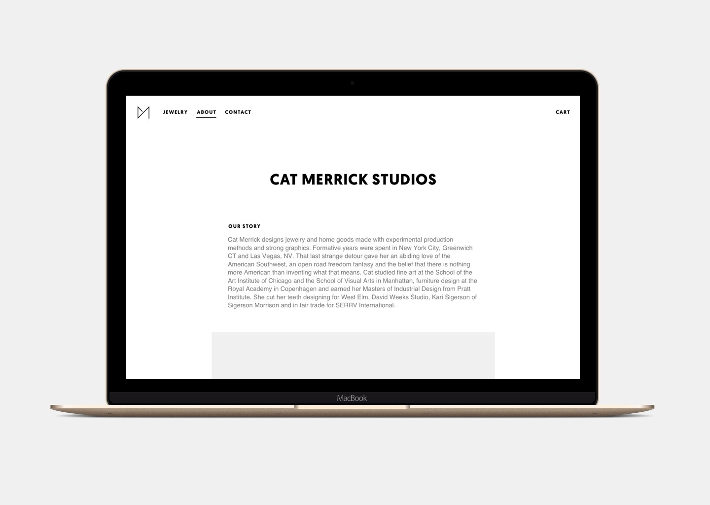
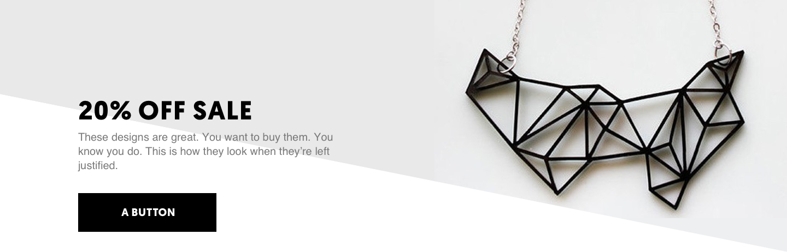
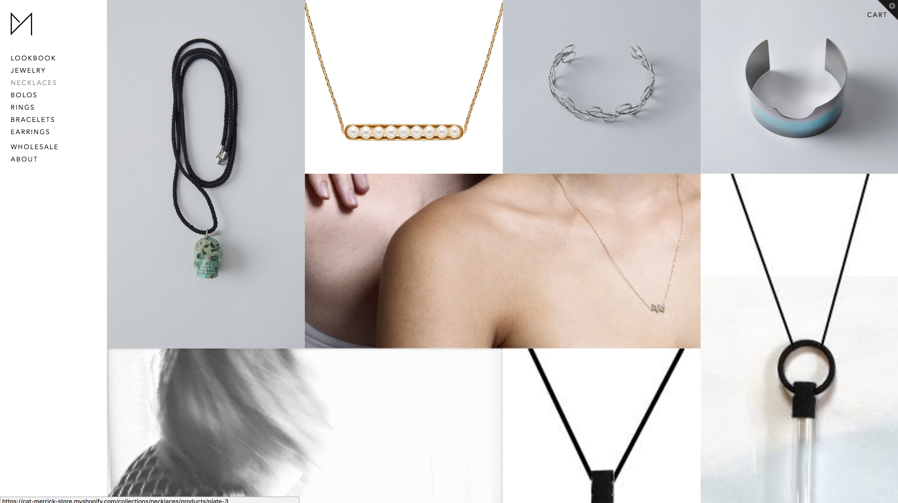
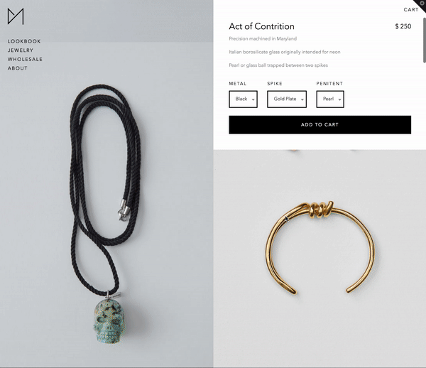

* user experience design
* visual design
* front-end dev

Designed and built a Shopify e-commerce theme for a minimalist line of industrial jewelry.

# Brief
- **Client**
	- Cat Merrick, an industrial and jewelry designer
- **The Challenge**
	- Design and build a branded, minimalist, high-fashion design that appealed to wholesalers, without alienating more usability-focused consumers.
- **Platforms**
	- Shopify
- **My Role**
	- With Cat's direction as a client, I designed and built her a custom Shopify theme.

*An early in-situ wireframe.*

*On the right path, but ultimately too commercial.*

*Final collection design.*

*Sticky product header.*   
