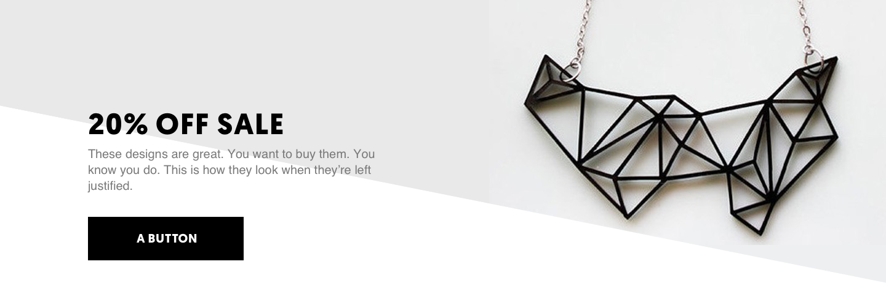
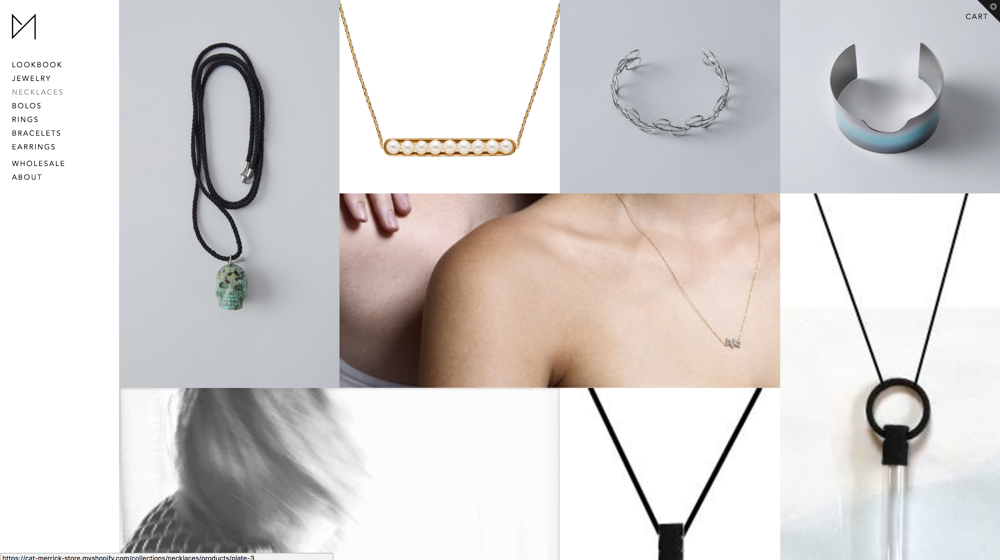
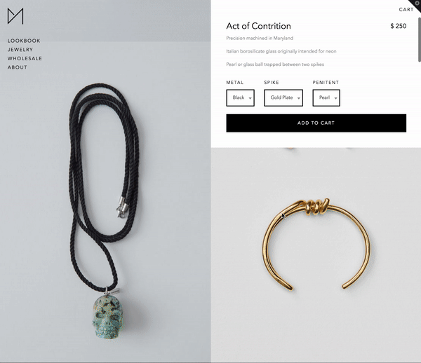

# Cat Merrick Studios
* user experience design
* visual design
* front-end dev

UI design in the high-fashion world is very complex. As Cat — a super friendly, brilliant industrial designer who’s breaking into the jewelry scene later this year — explained to me, there is a very weird and nebulous line to balance between minimalism and usability. Sites are designed to be minimalist, sparse, and in some cases, outright confusing — *on purpose.*

Utterly baffling for me, a UX designer, whose entire job is about making things **easy** to use. The initial market research for this project was a bizarro, Alice-in-Wonder-Land-style journey into a world that really hinges on the model of, “If you have to ask [how it works], you can’t afford it” — but the more I dug, the more I realized that minimalism and hidden features were really important brand signals to the kinds of customers who might buy out your entire line.

I was totally hooked: Cat herself is warm, open, friendly, brimming with creativity and gusto and tech-industry-like disruptiveness. It’s a huge part of her brand, her work, and her style. But the industry she’s about to disrupt is stark, minimalist, and has a bit of a “fuck you” attitude to outsiders and those who don’t immediately come across as “one of them.”

How do you marry those two totally different dynamics in a single website? What an awesome and fascinating design challenge.


*An early in-situ wireframe.*

### The Requirements
1. Cat wanted to be able to showcase her products by type, but didn’t want her shop to feel too sparse by splitting things up into groups.

2. She wanted the site to be easy to understand and navigate, but not feel out of place among websites that adhered to extreme minimalism, sometimes at the expense of what we both recognized as usability best practices.

3. She wanted to be able to use gifs and videos as the “featured” image for products, which is a feature Shopify doesn’t support out of the box.

4. She wanted to have a password-protected wholesale version of some, but not all, of the products.

5. She needed to be able to maintain all of this on her own, quickly and easily through the Shopify CMS. If at all possible, I wanted to avoid giving her something else to have to log into.

### Challenges
The first round of design included elements (above) with bold Geomanist font, dramatic diagonals, and interesting product photography. The basic elements of Cat’s in-progress brand were there — monochrome color scheme, focus on photography, geometric typeface — but it wasn’t quite right for her target audience. All of Cat’s pieces are hand-designed and individually crafted, and the big-box-store UX patterns had far too much of a “polished” and commercial feel.


*On the right path, but ultimately too commercial.*

On the UX and tech side, we were playing a long game of technology tetris: Cat needed to have a password-protected wholesale section, with separate pricing structures for her products, and at some point in the future was considering opening up a home goods line. But until then, we wanted to make sure the site didn’t feel empty or oddly organized. 

For non-bulk buyers, was a “wholesale” nav item distracting? What was the best way to organize products into categories and subcategories, and what was the best way to accomplish that in Shopify (which, we discovered, has significant security limitations when pulling product info via AJAX)? Because Cat was simultaneously designing and creating new products while we were designing and prototyping the site, the information architecture quickly became a sort of “chicken-and-egg” problem.



### Solutions
Ultimately, we settled on a single-page design for the jewelry collection, split into sections by Shopify sub-collections. This felt like the best of both worlds: show the user all of Cat’s products to keep the page feeling full, but maintain organization and structure. We tried a few different iterations of “filters” by various product attributes, but ultimately, there just weren’t enough products to filter by and they felt distracting. To keep load times down, I implemented some AJAX to dynamically load the next section as the user scrolled.

Visually, we found our mark with Avenir Next, which had just the right amount of structure to feel classy without feeling overly minimalist (like straight Helvetica) or too commercial (like Geomanist). Thick black lines and bold black buttons kept key calls-to-action prominent and top-of-mind. Everything else was stripped down to give more prominence to the product photography (all screenshots are using sample photos).

I was also able to add metafields to Shopify products so that Cat could upload gifs, embed YouTube links, add “product stories” — about the story behind each piece — and dictate different photos for different parts of the site.

And to keep time-on-site up, I added another “infinite-scroll” feature to the single product page, plus some javascript to make the product information “sticky”:




I’m particularly excited about how this individual product page turned out: because of limitations on how Shopify makes product data available, it took some figuring to add infinite scroll to individual product pages. As it turns out, unless you want to create your own Shopify Admin app, front-end scripts don’t have API access to product data — trying to pass (clean) product data to a Vue component turned out to be way more complicated than was worth it, and  in the end, I switched the project back to jQuery:

```js
function getNextProduct () {
    // Only get next product once
    tryLoadingNextProduct = false

	/* We've used Shopify's built in "next product in collection" feature
	/* to add a hidden <a> tag at the bottom of the current product
    /* Now, we just need to find that next product link on this page */
    var nextProductLink = $('#next-product')

    if (nextProductLink.length > 0) {
      // Okay Ajax, do your thing.
      $.get({ url: nextProductLink.find('a').attr('href') }, function (data) {
			
 	// Find the product container on the next page
        var next = $(data).find('.product-container')
        var id = next.data('product-id')
        var nextTitle = $(`<div class='next-product-header'>Next:&nbsp;</div>`)
		  
		// Append it to this page
        nextTitle.insertAfter('.product-container:last-of-type')
        nextTitle.append($(data).find('h1#product-title').html())

        next.insertAfter('.next-product-header:last-of-type')

        nextProductLink.removeAttr('id') // You're not the "next" anymore, link.

        layoutProductImages() // Lay out images again

        // Stickify the menu container
        if ($(window).width() > 768) {
          $('.product-container:last-of-type .product-description-main').stick_in_parent()
        }

        // Swap out gross selectboxes for pretty ones
        $('.selectify').select2({ width: 'auto' })

        $('select').on('select2:select', function(event) {
          onSelectChange($(this))
        })

        getProductData(id)

        tryLoadingNextProduct = true

      })
    }

  }
```

Ultimately, I think what we built is going to be a huge success, and I can’t wait to see her line launch later this year.

```front-matter
title: 'Cat Merrick Studios'
tag: 'ecommerce'
priority: 7
image: '/assets/early-wireframe.png'
excerpt: 'Balancing good UX and high-fashion aloofness in ecommerce design.'
```

#case-study