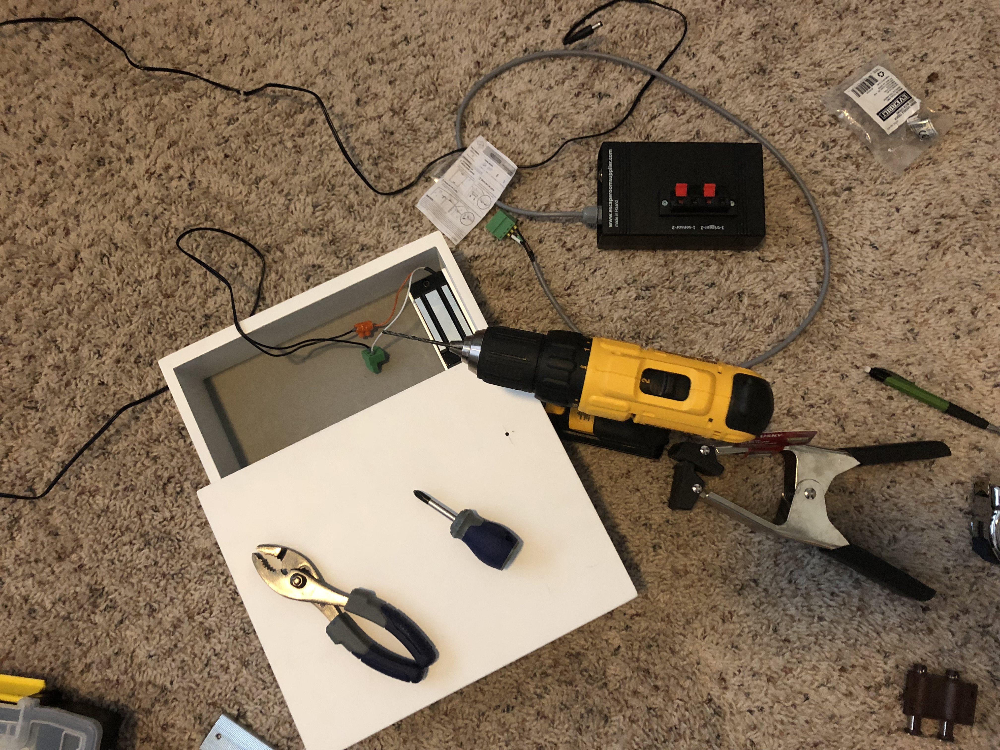
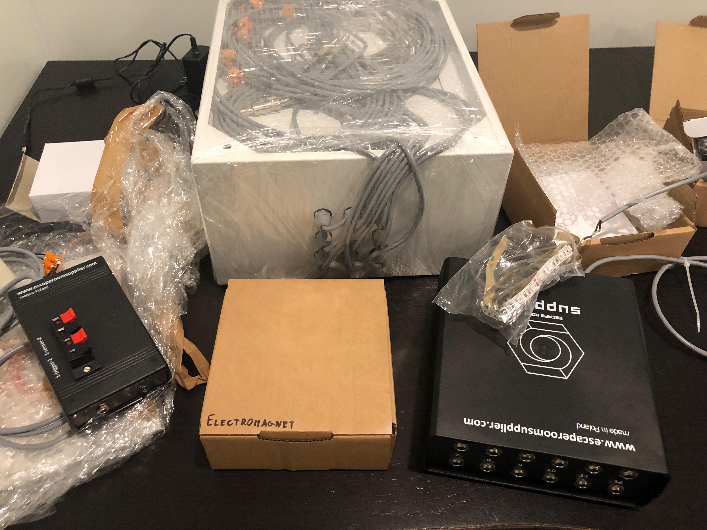

* Experience Design
* Creative Direction
* Writing

A pop-up escape room experience, aimed at giving our clients a delightful break from their conference activities.

# Brief
* **The Challenge:** Create a fun, interesting pop-up experience in no more space than 8’ by 8’.
* **The Goal:** Make people say “WOW that was fun. Who _are_ you guys?”
* **My Role:** Creative Director and Experience Designer: I led the project from start to finish, and managed our Art Director and Producer. This included designing and building the puzzles, developing the concept for the escape room’s universe, writing scripts, and designing and building the web app for the final puzzle.

# Background
Every year, [our company][1] goes to a conference hosted by one of our clients (and attended by a number of other current and potential clients). And every year, we try to think of ways to make our participation at the event delightful and unique.

This year — much to my own surprise — I managed to convince my boss to let me design and construct an 8’x8’ pop-up Escape Room for our vendor booth, complete with electronic puzzles, a 20-minute time limit, and magnetic locks.

Yeah. Seriously.

As a company, we’ve started to hone our brand and our positioning as a creative studio: we’re not an agency, we don’t do AOR contracts, and we’re not a deliverables factory. What we do is make radically collaborative, high quality stuff. We make websites and apps and feature films and pop-up experiences. We work directly with our clients to deeply understand what stuff we _should_ be making, and to ensure our messaging aligns with their strategic goals. If we don’t have a capability in-house, we hire the best.

Which doesn’t exactly fit many people’s expectations of a creative agency.

The Escape Room idea was born out of three business goals:

1. We wanted to differentiate ourselves from the crowded field of shops specializing in fast, cheap video. We aren’t just technicians — although our production department /is/ excellent. We’re expert storytellers and strategists, and we wanted to /show/ that we knew how to leave a lasting impression on audiences — not just tell them.
2. We wanted give our clients a fun, premium experience. We put a lot of effort into make working with us delightful. Conference booths are notoriously boring — and our company ethos is that we would rather die than be boring.
3. Making a great escape room sounded incredibly difficult and fascinating, and I was itching to sink my teeth into something new and challenging. Okay, so that’s not really one of our company’s business goals, but who’s counting?

  

[1]:	http://emergentorder.com
