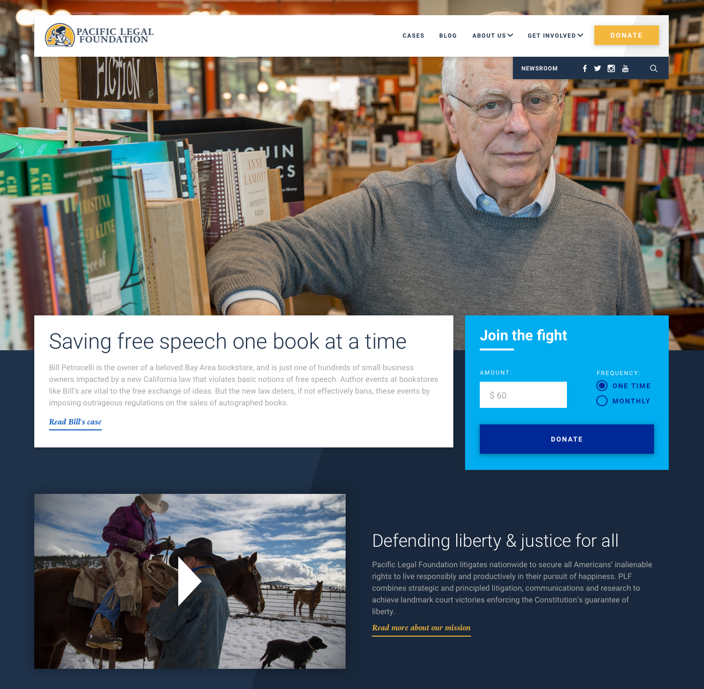
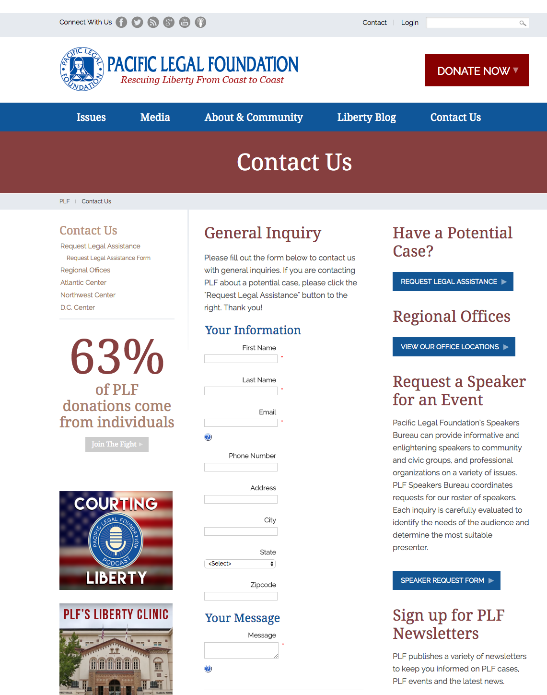
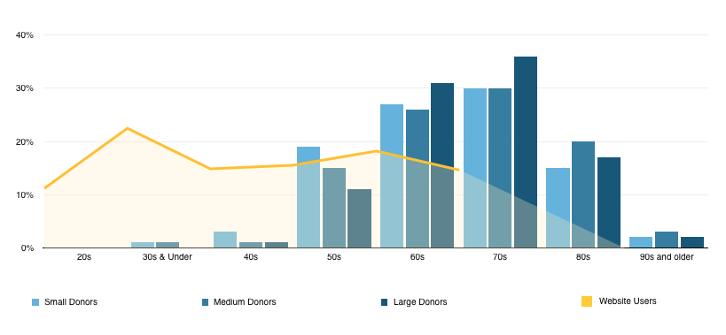
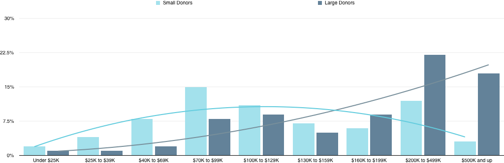
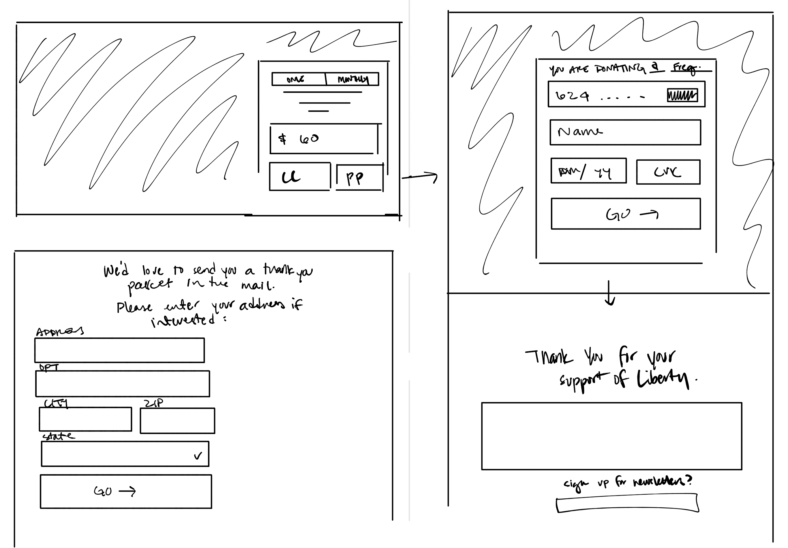
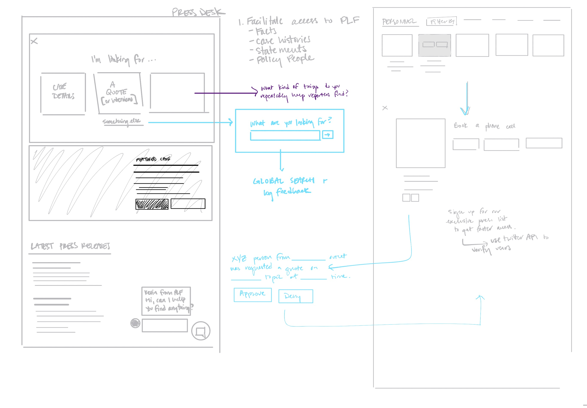
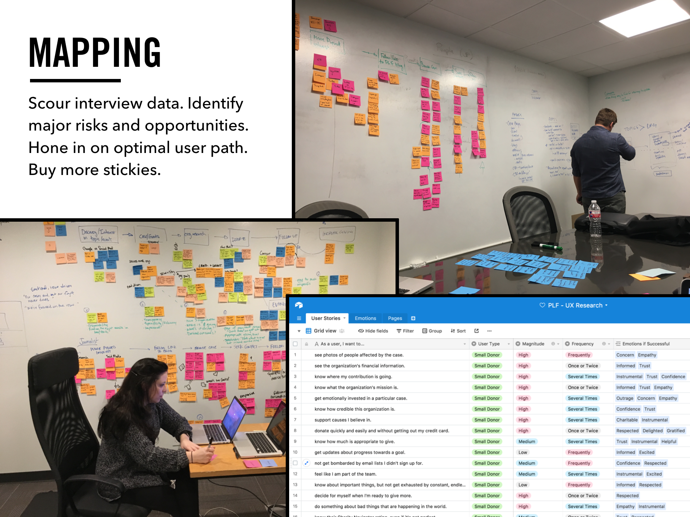
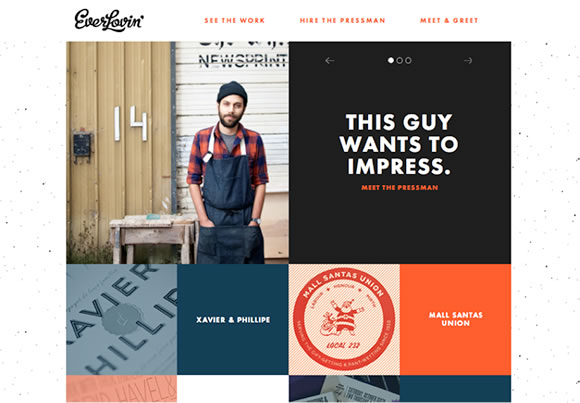
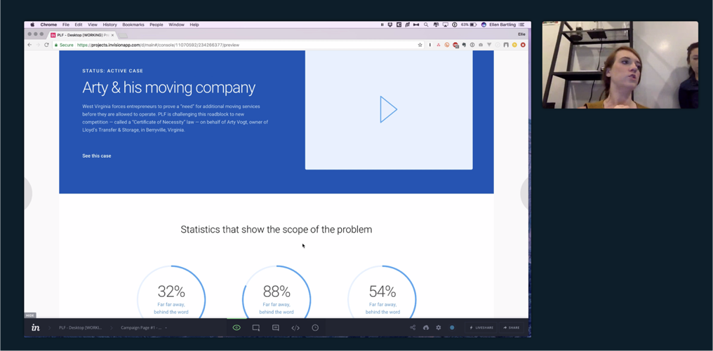
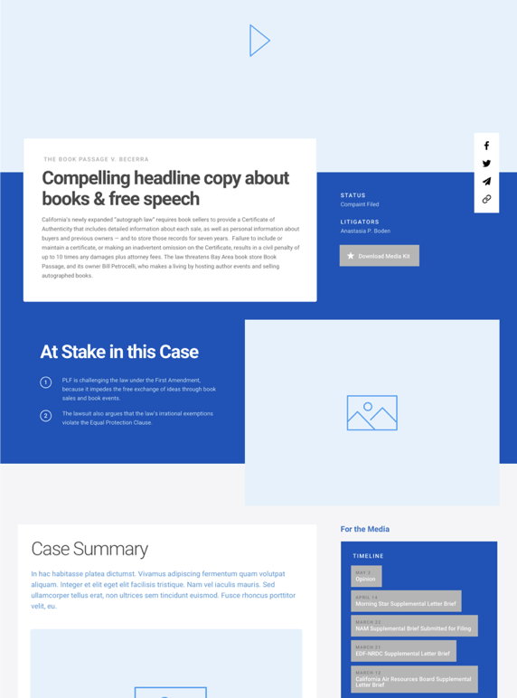

#### project
# Pacific Legal Foundation
#### Project Roles:
- Art Direction
- User Experience Design
- Visual Design
- Project Management

_The final product!_

### The Project
Pacific Legal Foundation is a non-profit law firm that defends American citizens against egregious government overreach and harassment. They’re like a slightly-more-land-rights-focused ACLU, and (until this year), they’ve joked that they’re the best kept secret in non-profit law.

Their website hadn’t been updated in quite some time, and wasn’t reflective of their cutting-edge work in the legal field. Their staff hated it, their donors hated it, and pretty much every stakeholder we talked to thought it was a “total mess.”

_The old site 😱._

PLF knew that their site could be doing more business for them, and one of their top priorities was designing a product that better communicated their brand as a thought-leader, and sparked new relationships with potential donors. They also wanted to start planting the seeds for a relationship with younger donors, who were increasingly demanding a much better online experience from them, and to foster more productive relationships with reporters, who were frustrated with how hard it was to find information on their old site.

### Research
Unfortunately, there were almost no data from Google Analytics to work with. PLF’s old site was built using an ancient version of Blackbaud, and because of the way their platform works, there was absolutely no behavioral or waterfall data to work with. /C’est la vie/, sometimes.

_All we could  grab from GA was demographics data — which, surprisingly, skewed WAY younger than PLF’s usual donor base. We immediately identified this as an opportunity to talk to their new target audience._

While the timeline and the budget were extremely tight, we decided early on that without any analytics data, we’d need to conduct our own research. We set up a series of initial interviews with 8 users — 4 older millennials, with a history of charitable giving, and 4 journalists at various stages of their careers.

And then we got to sketching.

### Sketching
What we heard immediately from both user groups was that storytelling was the Most Important Thing. Donors and Journalists alike were searching for compelling stories, and they walked away the millisecond jargon-y legalese got in their way of understanding /why/ something was important.

We also learned that donors frequently didn’t know how much they were expected to donate — and that this was a surprisingly big barrier to donating at all.

After 8 hours of interviews, we had generated a ton of insights. Figuring out what was data and what was noise was tough with the number of interviews we had (it’s all we had the budget for), but as we started filtering and categorizing, we began to get a clearer picture of what our users wanted — and more importantly, what we still needed to figure out during testing.

### Moodboards
Alongside the initial interviews, we produced three different moldboards to hone in on the how PLF’s branding would be implemented on the new site. Our company’s brand identity team had worked with them on a new logo, but it was our job to take the new identity and create an entire visual design system around it.

They wanted to be edgy, aggressive, modern, and high-energy. They wanted to be respected and professional and buttoned-up, but with just a tiny little hint of “my-way-or-see-you-in-court-motha-f*ers.” They had 45 years of history that they cherished and which informed their company culture — but they also wanted to look forward to the future, and show how innovative and non-traditional they were in their work.

We came up with an aesthetic based around color-blocking: using bright colors and tons of photos to bring a vividness and tech-y feel to their brand, while still focusing on their clients’ stories.

### UX Design + Testing

### Outcomes
Within one month of launch, Pacific Legal Foundation collected *four times* as many donations via the new website as they had in *the last twelve months combined.*

Mission accomplished!