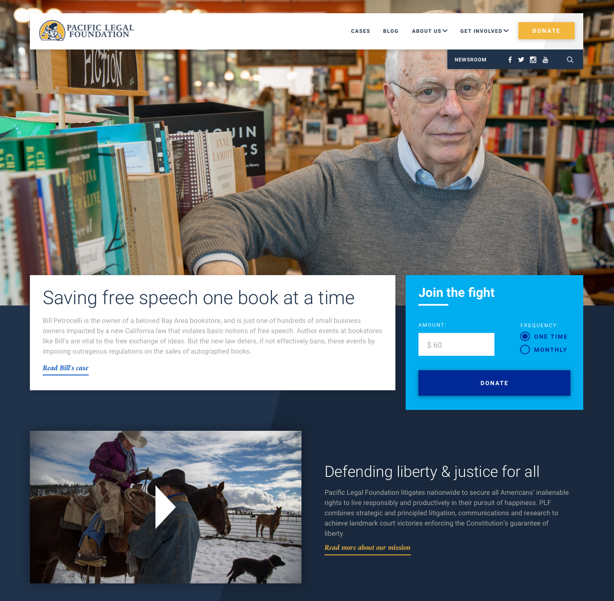
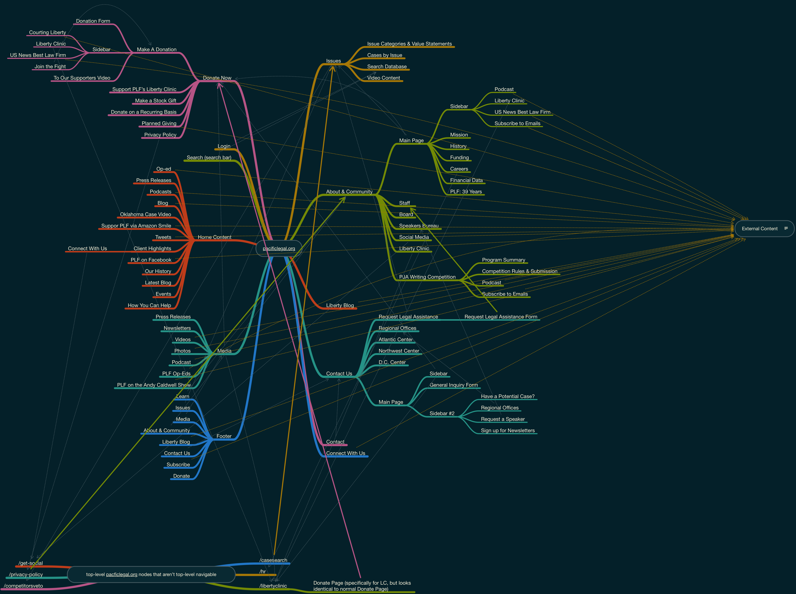
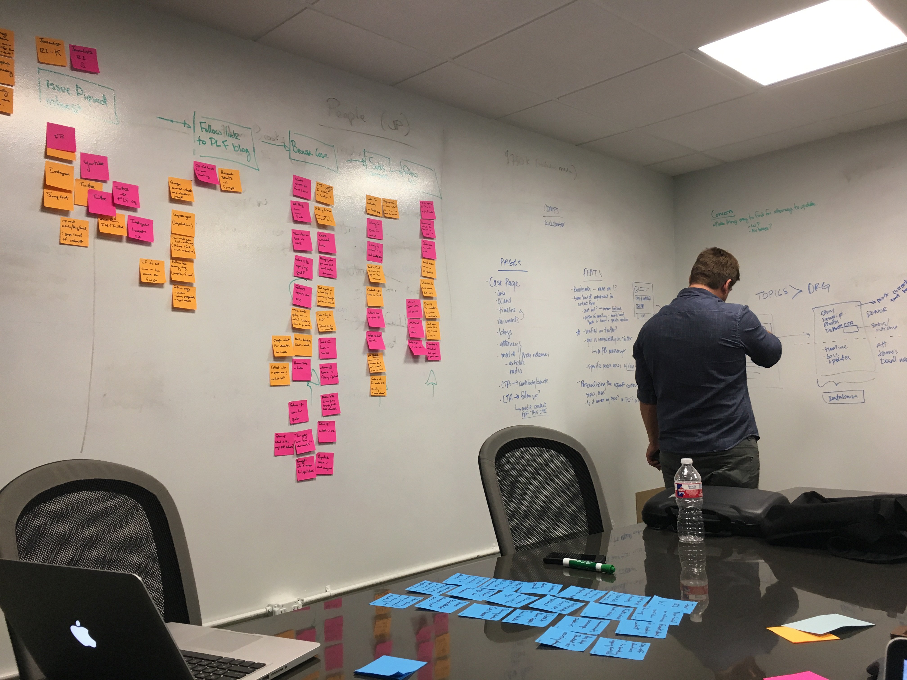
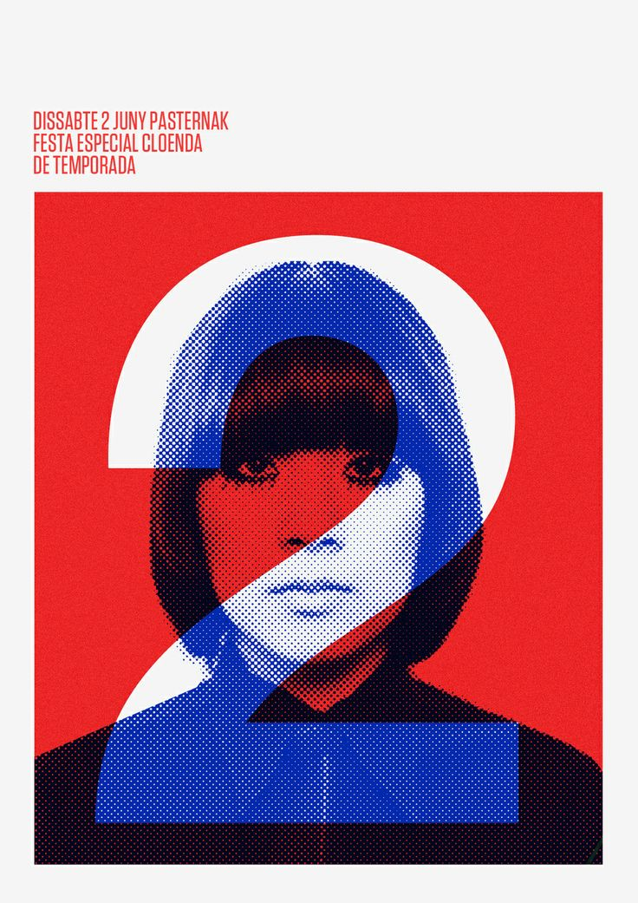
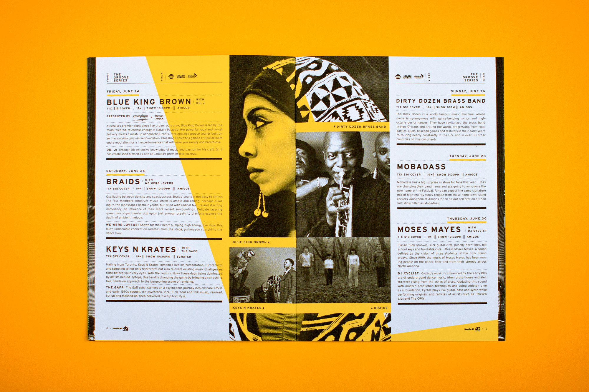
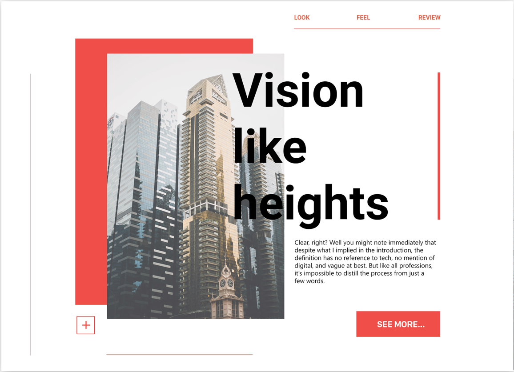
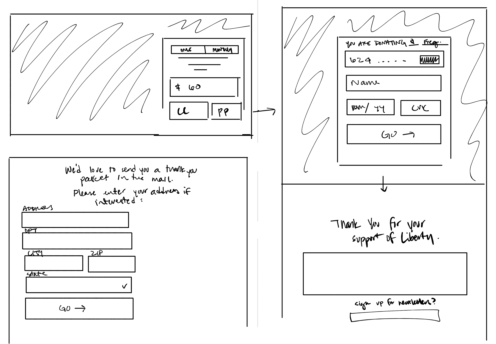

# pacific legal foundation
- Art Direction
- User Experience Design
- Visual Design
- Project Management

_The final product!_

#### the project
## Sometimes, you really have to click every link to see how far the mess goes.
Pacific Legal Foundation is a non-profit law firm that defends Americans against egregious government overreach and harassment. They’re like a slightly-more-land-rights-focused ACLU, and (until this year), they’ve joked that they’re the best kept secret in non-profit law.

Their website hadn’t been updated in quite some time, and wasn’t reflective of their cutting-edge work in the legal field. Their staff hated it, their donors hated it, and pretty much every stakeholder we talked to thought it was a “total mess.”

_The old site’s “Contact Us” page._

The most immediately pressing concern for me was how un-discoverable their content was. The more I clicked around, the more links I found that took users in circular UX patterns, or offsite completely.

_A mind-map of all the pages and links of the old site. Yellow lines show where main navigational links take users to other sites._

PLF knew that their site could be doing more business for them, and one of their top priorities was designing a product that better communicated their brand as a thought-leader, and sparked new relationships with potential donors. They also wanted to start planting the seeds for a relationship with younger donors, who were increasingly demanding a much better online experience from them, and to foster more productive relationships with reporters, who were frustrated with how hard it was to find information on their old site.

#### Research
## What do you do when there's no tracking? 🤔
Unfortunately, there were almost no data from Google Analytics to work with. PLF’s old site was built using an ancient version of Blackbaud, and because of the way their platform works, there was absolutely no behavioral or waterfall data to work with. On top of which, the domain was actually split into two sites: the main Blackbaud-powered site, and a Wordpress-powered blog, running two separate instances of Google Analytics. _C’est la vie_, sometimes.

All we could reliably grab from GA was demographics data — which, surprisingly, skewed WAY younger than PLF’s usual donor base. We immediately identified this as an opportunity to talk to their new target audience.

While the timeline and the budget were extremely tight, we decided early on that without any analytics data, we’d need to conduct our own research. We set up a series of initial interviews with 8 users — 4 older millennials with a history of charitable giving, and 4 journalists at various stages of their careers.

And then we got to sketching.

#### Insights
## This is why we sticky-note things.
### Storytelling is the most important thing
What we heard immediately from both user groups was that storytelling was the Most Important Thing. Donors and Journalists alike were searching for compelling stories, and they walked away the millisecond jargon-y legalese got in their way of understanding _why_ something was important.

### People just want to know what you expect
One surprising insight we found during the initial interviews that that even really enthusiastic donors frequently didn’t know how much they were expected to donate — and that this was a surprisingly big barrier to donating at all. Once someone had decided to donate, we heard over and over that feelings of shame or confusion about donating the wrong amount (specifically, less than the expected amount) prevented a handful of users from donating at all. We saw this as a huge opportunity to help the organization and enthusiastic donors communicate with each other better, and would hopefully improve conversion rates.

_Obligatory UX mapping process involving lots of stickies._

### No one really thinks about “issues”
Though PLF is an ideologically-driven organization, we found that most of our interviewees didn’t really think of their donations in that way. Donors absolutely had political opinions and subscribed to certain ideologies, but when it came time to donate to their favorite organizations, their motivations were incredibly practical and specific: “X organization is working on this very specific case that I care about,” or “Y organization is always getting things done.” We took this as further evidence that we should focus the design around specific cases, rather than on broad issues.

#### Moodboards
## Where branding and UX design collide.
Alongside the initial interviews, we produced three different moodboards to hone in on the how PLF’s branding would be implemented on the new site. Our company’s brand identity team had worked with them on a new logo, but it was our job to take the new identity and create an entire visual design system around it.

They wanted to be edgy, aggressive, modern, and high-energy. They wanted to be respected and professional and buttoned-up, but with just a tiny little hint of “my-way-or-see-you-in-court-motha-f*ers.” They had 45 years of history that they cherished and which informed their company culture — but they also wanted to look forward to the future, and show how innovative and non-traditional they were in their work.

We came up with an aesthetic based around color-blocking: using bright colors and tons of photos to bring a vividness and modern feel to their brand, while keeping the storytelling focus that our user research indicated was so crucial.

#### design & testing
## Needs less cowbell.
Since the client's major KPI for the website was radically increasing and modernizing their donation pathway, we took on the challenge of taking their 5-step, 27-field donation process and reducing it down to just 4 fields.

_An early donation sketch, moving the request for a mailing address to **after** the donation was completed._

We also wanted to help solve the problem of uncertain donation expectations. In interviews, donors told us that they weren't sure how much was appropriate to donate, and while donors in our age group were budget-conscious, they felt uncomfortable about donating "too little" to make a difference. When facing dropdown boxes or radio options for donations, they told us that they "felt stingy" if they chose the smallest amount, but frequently just couldn't afford the larger amounts.

So we decided on a design pattern that used a single, pre-filled text box for the donation amount instead of a dropdown menu to try to streamline the process even further, and give users a strong signal of what kinds of donations we really wanted to capture.

_The final Donation Box design. Users could still easily change the amount if they preferred to give some other amount, but the suggested amount was clear, reasonable, and "interesting" according to our Round 2 testing subjects._

PLF assured us that a focus on small donors was key to a sustainable long-term donation pipeline, and their median donation on the website in the previous two years had been $50, so we went with $60 as our "suggested donation": it was an unusual enough amount that we could easily see if our suggestion strategy was making an impact, and sure enough, while most donations post-launch were above $60, the most frequent donation amount after launch was $60.

#### Outcomes
## How'd we do?
Within one month of launch, Pacific Legal Foundation collected **four times** as many donations via the new website as they had in **the last twelve months combined.**

Historically, the website had barely eked out a few thousand dollars of donations a year.

> Within 100 days of launch, the new site had drawn in six-figures worth of donations.

Mission accomplished! 👩🏻‍🚀
