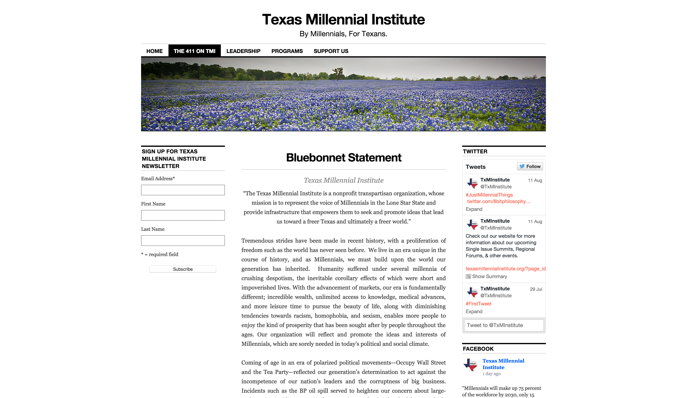
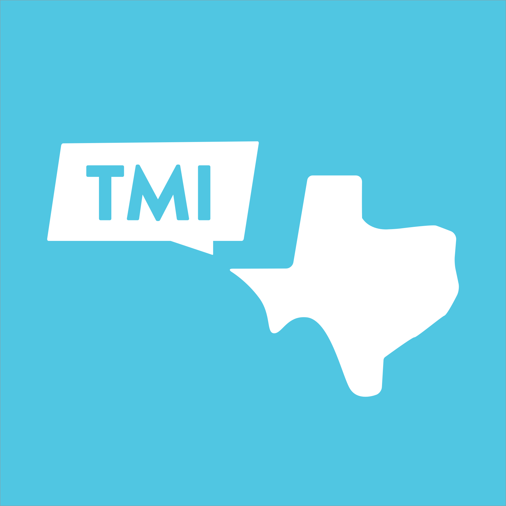
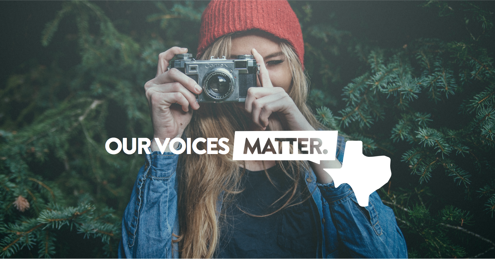
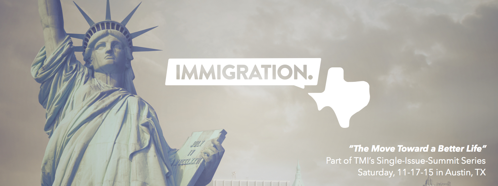

# Texas Millennial Institute
* visual design
* branding

There are a ton of public policy organizations that want to talk to Millennials; very few are actually _run_ by millennials. When the founders of the Texas Millennial Institute decided they wanted to create their own non-profit and forge their own path (complete with a new brand identity), they knew one thing for certain: they didn’t want their audience to think they were boring, stale, or, worst of all, _old_. 


*TMI’s first website, with their old logo.*

One of the interesting challenges of working with non-profit organizations is that they have to serve two masters: their audience, and their donors. For TMI, this meant their branding needed to be playful, fun, and genuinely “Millennial” — but it also needed to signal that they were the kind of organization that was serious and professional enough to be trusted with grants and donations. Balancing this line was especially important for TMI, whose entire organization is run by younger officers, and whose mission is to host events that genuinely engage with issues that Texan millennials care about.



After a few back-and-forths over how to balance the line between professionalism and genuineness, I presented the TMI team with this mark — a playfully rounded Texas icon, with a chat bubble coming from El Paso. The light blue and rounded features keeps it feeling young and exciting, but the clean shapes and monotone color palette keeps the brand from feeling messy or disorganized.

We tried a number of different typefaces — from Proxima Nova, to a grainy, almost comic-book style sans — and settled on Brandon Grotesque. Geometric and structured, but with a hint of rounded corners, I think Brandon balances out TMI’s competing mandates particularly well. 

In TMI’s extended branding kit, the mark becomes extremely flexible: it’s recognizably “TMI” even when the chat bubble is filled with other text, like a teaser for their latest events’ content, or an ad for their organization’s mailing list. 

A few examples of extended branding that I produced for them:


*An ad for TMI’s new brand.*


*An event banner for a summit on Immigration Policy.*
```front-matter
title: 'Texas Millennial Institute'
priority: 7
image: '/assets/hero-photo.png'
excerpt: 'Designing a professional, flexible identity for a tongue-in-cheeck Millennial non-profit.'
```

#case-study

